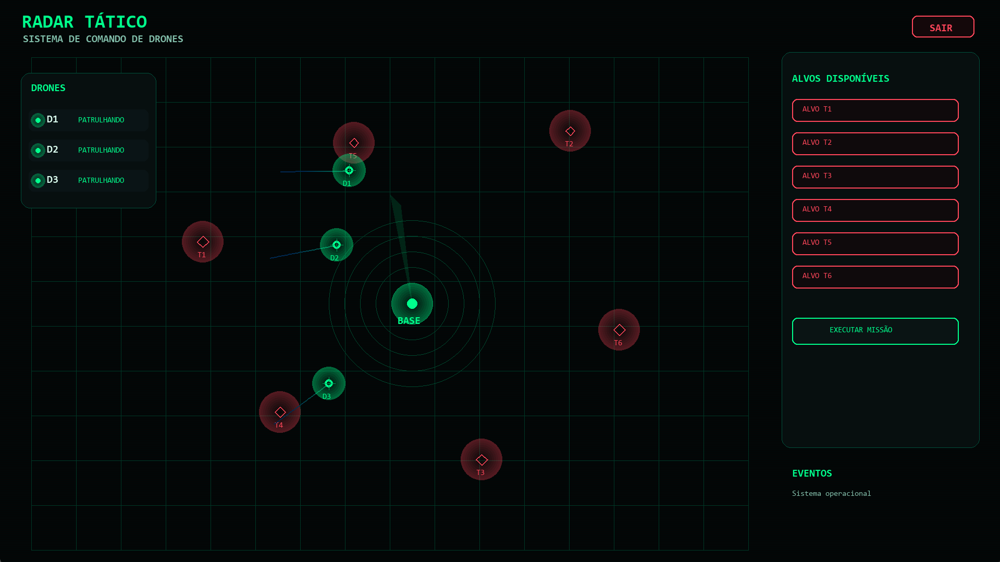

# Tactical Radar Drone Simulation System

Real-time tactical radar simulation system designed for drone tracking, target monitoring, and mission control visualization.

---

# Preview



---

# Overview

This project simulates a tactical drone command interface inspired by military radar systems and real-time monitoring environments.

The simulation includes:

- Real-time radar sweep
- Drone patrol tracking
- Tactical HUD interface
- Dynamic hostile targets
- Event monitoring
- Mission execution system
- Animated visualization

The main objective of this project is to study:

- Real-time rendering
- Simulation systems
- Interactive interfaces
- Coordinate systems
- Radar visualization concepts
- Event-driven architecture

---

# Features

- Real-time radar rendering
- Animated radar sweep effect
- Drone tracking system
- Dynamic hostile targets
- Tactical control panel
- Event logging system
- Interactive mission button
- Military-inspired UI/HUD
- Smooth object movement
- Sound support

---

# Technologies Used

- Python
- Pygame
- Math
- Real-time rendering systems

---

# Demo Video

[Watch Demo Video](./assets/demo.mp4)

---

# Project Structure

```txt
Tactical-Radar-Drone-Simulation-System/
│
├── assets/
│   ├── preview.png
│   └── demo.mp4
│
├── main.py
├── README.md
├── requirements.txt
├── .gitignore
└── LICENSE
```

---

# Installation

Clone the repository:

```bash
git clone https://github.com/GMello-bc/Tactical-Radar-Drone-Simulation-System.git
```

Enter the project folder:

```bash
cd Tactical-Radar-Drone-Simulation-System
```

Install dependencies:

```bash
pip install -r requirements.txt
```

Run the project:

```bash
python main.py
```

---

# System Components

## Radar Engine

Responsible for:

- Radar sweep calculations
- Object rendering
- Detection simulation
- Coordinate mapping

## Drone System

Each drone includes:

- Patrol behavior
- Dynamic movement
- Tracking logic
- Operational status

## Tactical HUD

Displays:

- Active drones
- Threat targets
- Mission controls
- System events

---

# Future Improvements

- AI-controlled drones
- Advanced radar modes
- Multiplayer simulation
- Terrain system
- Heat signature detection
- Pathfinding algorithms
- Networking support
- OpenGL rendering
- ECS architecture

---

# Project Goals

This project was developed to improve knowledge in:

- Real-time systems
- Simulation architecture
- Computer graphics concepts
- Interface design
- Interactive applications
- Tactical visualization systems

---

# License

MIT License